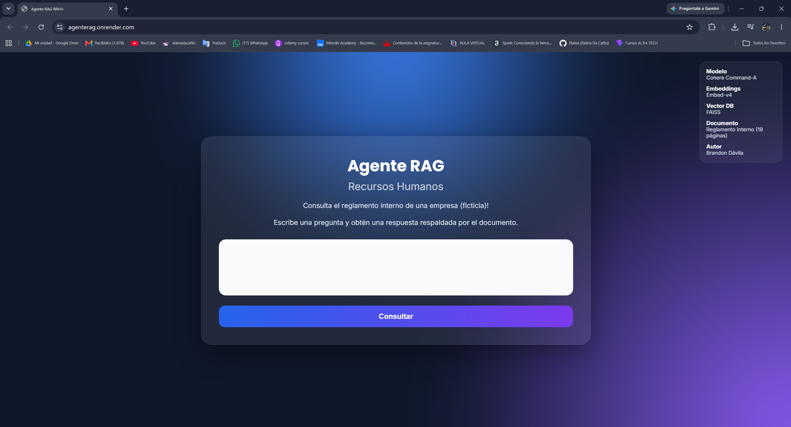
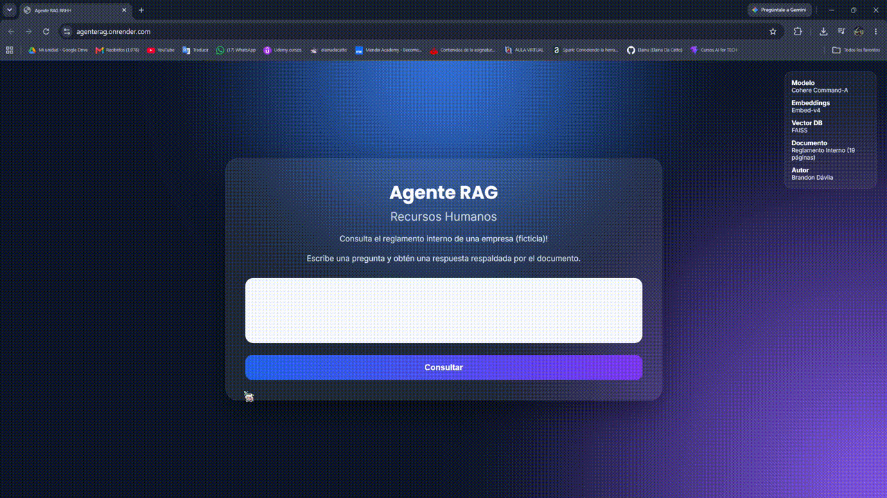

# Agente RAG para Consulta de PDFs (Reglamento interno en este caso)


Agente RAG desarrollado en **Python** que permite consultar información contenida en documentos PDF mediante lenguaje natural.

El proyecto implementa la arquitectura **Retrieval-Augmented Generation (RAG)** utilizando **LangChain**, **Cohere**, **FAISS** y **FastAPI**, permitiendo responder preguntas sobre un reglamento interno de una empresa ficticia de manera rápida y precisa.

**Requiere de una API KEY de cohere. Es posible cambiar el modelo y algunos ajustes desde config.py**

# Características

- Consulta documentos PDF mediante lenguaje natural.
- Base vectorial FAISS.
- Modelo de lenguaje Cohere Command-A.
- Interfaz web desarrollada con HTML, CSS y JavaScript.
- API REST con FastAPI.
- Contenedorización mediante Docker.

# Tecnologías utilizadas

|       Tecnología        |           Uso             |
|-------------------------|---------------------------|
| Python                  | Lenguaje principal        |
| FastAPI                 | API REST                  |
| LangChain               | Orquestación del agente   |
| Cohere Command-A        | Modelo de lenguaje        |
| Cohere Embed-v4         | Generación de embeddings  |
| FAISS                   | Base vectorial            |
| PyPDF                   | Lectura del documento PDF |
| HTML / CSS / JavaScript | Interfaz web              |
| Docker                  | Contenedorización         |


# Estructura del proyecto

```text
AgenteRAG/
│
├── app/
│   ├── api/
│   ├── core/
│   ├── services/
│   ├── static/
│   ├── templates/
│   └── main.py
│
├── documentos/
│
├── vectorstore/
│
├── Dockerfile
├── requirements.txt
├── .env.example
└── README.md
```

# Instalación

## 1. Clonar el repositorio

```bash
git clone https://github.com/6rand0n/AgenteRAG.git

cd AgenteRAG
```

## 2. Crear entorno virtual

Windows

```bash
python -m venv .venv

.venv\Scripts\activate
```

Linux

```bash
python3 -m venv .venv

source .venv/bin/activate
```

## 3. Instalar dependencias

```bash
pip install -r requirements.txt
```

## 4. Crear el archivo `.env`

```env
COHERE_API_KEY=TU_API_KEY
```

## 5. Ejecutar la aplicación

```bash
uvicorn app.main:app --reload
```

Abrir:

```
http://localhost:8000
```

# Ejecutar con Docker

Construir la imagen

```bash
docker build -t agente-rag .
```

Ejecutar el contenedor

```bash
docker run --rm -p 8000:8000 --env-file .env agente-rag
```

Abrir

```
http://localhost:8000
```

# Ejemplos de preguntas

- ¿Cuántos días de vacaciones corresponden?
- ¿Cuál es el horario laboral?
- ¿Qué beneficios reciben los trabajadores?
- ¿Cómo funciona el proceso de onboarding?
- ¿Qué ocurre en caso de retardos?
- ¿Qué permisos puede solicitar un empleado?

# Capturas

## Pantalla principal



## Ejemplo de consulta


## Demostración

<p align="center">
  
</p>

# Despliegue

El proyecto fue desplegado utilizando **Render** mediante Docker.

URL de la aplicación:

```
https://agenterag.onrender.com/
```

# Documento utilizado

El agente trabaja sobre un **Reglamento Interno de Trabajo** de una empresa ficticia denominado:

**reglamentoDeTrabajo_FicticiaDeMexicoCV.pdf**

El documento contiene información relacionada con:

- Contratación
- Jornada laboral
- Vacaciones
- Beneficios
- Permisos
- Código de conducta
- Onboarding
- Recursos Humanos

Siempre es posible utilizar un documento diferente. Para ello, basta con actualizar la variable `PDF_PATH` en `app/core/config.py` para que apunte al nuevo archivo PDF. Después, es necesario eliminar la carpeta `vectorstore` y volver a ejecutar la aplicación. Durante el inicio, el sistema detectará que no existe un índice vectorial y generará automáticamente uno nuevo a partir del documento especificado.

---

# Autor

**Brandon Javier Becerra Dávila**

Proyecto desarrollado como desafío del programa **Alura Agentes de IA**.
